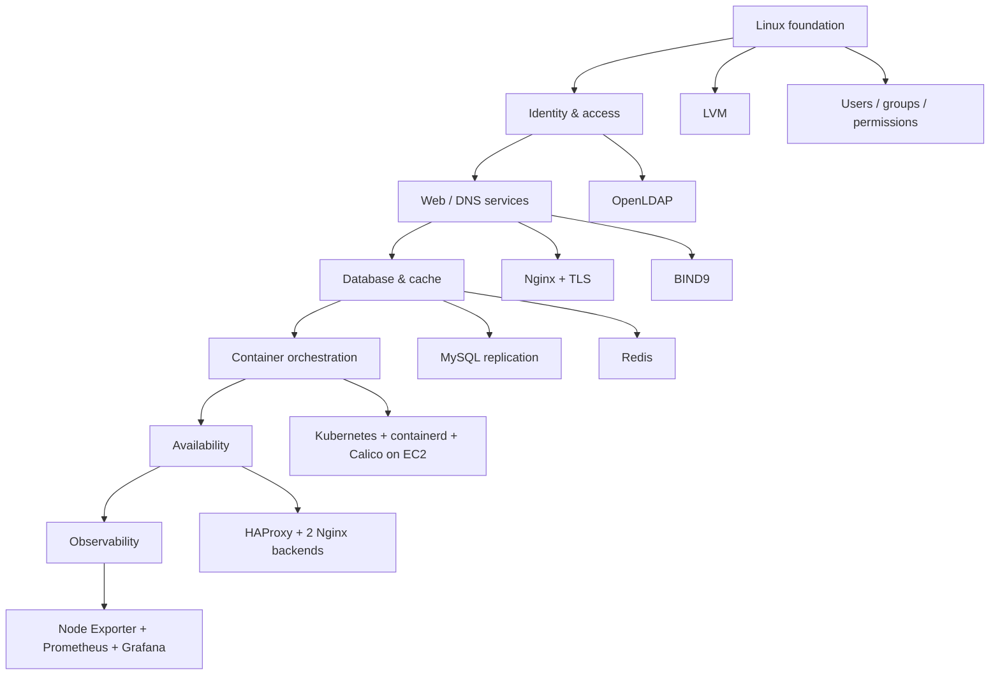

# Architecture & Scope

This repository represents a **series of labs**, not one monolithic application.

## Conceptual progression

## Trust boundaries encountered

1. **Local OS boundary** — Unix users, groups, sudo, file permissions.
2. **Directory-service boundary** — LDAP server vs LDAP clients.
3. **Network-service boundary** — Nginx, BIND9, MySQL and Redis listening interfaces/firewall rules.
4. **Cloud network boundary** — EC2 security groups separating Kubernetes roles and ports.
5. **Observability boundary** — exporters expose telemetry endpoints that should be restricted in production.

## Production-readiness perspective

The labs intentionally use educational shortcuts such as self-signed certificates, simple local domains, direct service installation, and small node counts. Production systems should additionally consider secret management, automated configuration/IaC, backup/restore testing, TLS from trusted PKI, restrictive firewall policy, service hardening, alerting, redundancy, upgrades, and disaster recovery.