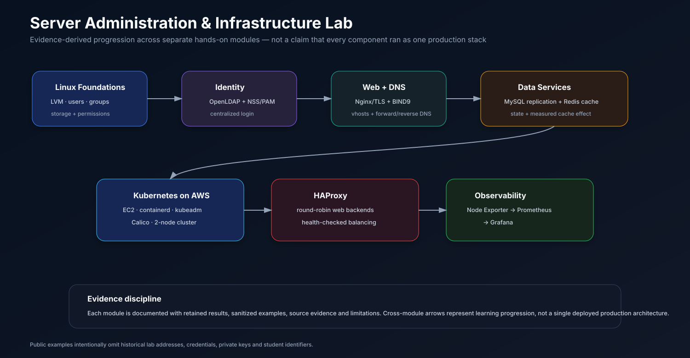

# Server Administration & Infrastructure Lab

> Evidence-based portfolio case study covering Linux systems administration, network services, data services, container orchestration, high availability, and observability.

**Course:** Administrasi Sistem Server — Teknik Informatika, Universitas Brawijaya  
**Project type:** Collaborative semester-long laboratory portfolio  
**Role:** **Group Lead / Ketua Kelompok & Systems Administration Contributor — Syifani Adillah Salsabila**  
**Team:** Syifani Adillah Salsabila, Mochammad Attila Eka Raharjo, Ananda Fifadlika  
**Period:** 2025/2026 academic year

## Overview

This repository reconstructs a 181-page final server-administration module into a recruiter-friendly engineering portfolio. The coursework progressed from Linux storage and identity fundamentals into centralized directory services, web/DNS/database administration, caching, Kubernetes on AWS, load balancing, and monitoring.

The public repository intentionally **does not publish the raw report** because it contains student identifiers, historical lab addresses, screenshots, and environment-specific credentials. Instead, it keeps sanitized examples and maps portfolio claims back to retained evidence.

> **Scope note:** these were separate hands-on modules. The visual below shows the progression of infrastructure skills; it does **not** claim that every component ran together as one production platform.

  

## Senior technical review path

A reviewer can inspect the implementation evidence directly instead of relying on summary claims:

1. **Storage & Linux IAM:** [docs/01-storage-lvm.md](./docs/01-storage-lvm.md) and [docs/02-user-permissions.md](./docs/02-user-permissions.md).
2. **Centralized identity:** [docs/03-openldap.md](./docs/03-openldap.md).
3. **Web & DNS:** [docs/04-nginx-tls.md](./docs/04-nginx-tls.md), [docs/05-bind9-dns.md](./docs/05-bind9-dns.md), and sanitized configs in [`examples/nginx/`](./examples/nginx/) and [`examples/bind9/`](./examples/bind9/).
4. **Data & caching:** [docs/06-mysql-replication.md](./docs/06-mysql-replication.md) and [docs/07-redis-caching.md](./docs/07-redis-caching.md).
5. **Cloud orchestration & availability:** [docs/08-kubernetes-aws.md](./docs/08-kubernetes-aws.md), [`examples/kubernetes/sample-app.yaml`](./examples/kubernetes/sample-app.yaml), [docs/09-haproxy-load-balancing.md](./docs/09-haproxy-load-balancing.md), and [`examples/haproxy/haproxy.cfg.example`](./examples/haproxy/haproxy.cfg.example).
6. **Observability:** [docs/10-prometheus-grafana.md](./docs/10-prometheus-grafana.md) and [`examples/prometheus/prometheus.yml.example`](./examples/prometheus/prometheus.yml.example).
7. **Evidence discipline:** [RESULTS.md](./RESULTS.md), [SOURCE_EVIDENCE.md](./SOURCE_EVIDENCE.md), [docs/EVIDENCE_MAP.md](./docs/EVIDENCE_MAP.md), [LIMITATIONS.md](./LIMITATIONS.md), and [`scripts/validate_examples.py`](./scripts/validate_examples.py).

## What was actually validated

| Area | Retained result | Evidence level |
|---|---|---|
| LVM | Added a virtual disk, created a PV, extended the VG/LV, resized `/home`, and verified capacity growth | **Verified** |
| Linux IAM | Created users/groups, sudo access, file ownership, and permission boundaries | **Verified** |
| OpenLDAP | Centralized OU/group/user management and LDAP client login after NSS/PAM troubleshooting | **Verified** |
| Nginx | Two virtual hosts, HTTPS with self-signed TLS, HTTP→HTTPS redirect, gzip/static-cache tuning | **Verified** |
| BIND9 DNS | Forward zones, reverse zone/PTR, client DNS configuration, successful `nslookup` | **Verified** |
| MySQL | Asynchronous primary-replica lab; IO/SQL replication threads reported running | **Verified** |
| Redis | Database access measured at ~70 ms without cache vs ~3.7 ms with Redis in the lab (~19× faster) | **Verified experiment** |
| Kubernetes | Two-node AWS EC2 cluster, containerd, kubeadm, Calico; both nodes reached `Ready` | **Verified** |
| HAProxy | Repeated `curl` responses alternated between two Nginx backends using round-robin | **Verified** |
| Monitoring | Node Exporter target `UP`, Prometheus scraping, Grafana dashboard, Prometheus API queried via cURL/Python | **Verified** |
| Public example integrity | Nginx/BIND/HAProxy/Prometheus/Kubernetes invariants + obvious secret-pattern checks | **Automated in CI** |

## Technical highlights

### Linux storage and identity
The storage lab added a new virtual disk, converted it into an LVM Physical Volume, extended the existing Volume Group and Logical Volume, resized the filesystem, and verified the new `/home` capacity. The Linux IAM lab covered users, groups, sudo access, ownership, and permissions. OpenLDAP then extended identity management across hosts through directory-backed accounts and NSS/PAM integration.

### Web and DNS services
Nginx hosted multiple virtual hosts, redirected HTTP to HTTPS, referenced TLS certificate/key files, and applied basic static-cache behavior. BIND9 configured two forward zones and a reverse-zone pattern. The public examples retain these design invariants while omitting historical lab values.

### Database replication and caching
The MySQL module exercised asynchronous primary-replica behavior and retained evidence that both replication threads were running. The Redis module measured approximately **0.07 s** for a direct database read and **0.0037 s** for the Redis-backed path in that specific lab, roughly **19× faster**. This is retained experiment data, not a universal Redis benchmark.

### Kubernetes on AWS EC2
A two-node cluster was built using EC2, containerd, kubeadm/kubelet/kubectl, and Calico. Troubleshooting covered EC2 IP selection, package/repository setup, security-group access to the API server, swap configuration, and container runtime integration. The sanitized Kubernetes example uses a two-replica Deployment plus a ClusterIP Service to demonstrate workload/service structure without exposing historical infrastructure identifiers.

### Load balancing and observability
HAProxy used `balance roundrobin`, two health-checked web backends, and repeated requests to demonstrate alternating responses. The observability lab used Node Exporter → Prometheus → Grafana, with Prometheus scraping on a 15-second interval in the public example and Node Exporter represented on port `9100`.

## Automated artifact validation

[`scripts/validate_examples.py`](./scripts/validate_examples.py) runs in GitHub Actions on every push and pull request. It checks that the public artifacts remain aligned with the documented lab design:

- Nginx still has HTTP→HTTPS redirection, a TLS listener, and certificate references;
- BIND9 still contains two forward-zone examples and reverse-zone intent;
- HAProxy still uses round-robin, two backends, and health checks;
- Prometheus still retains the Node Exporter target pattern;
- Kubernetes still contains a two-replica Deployment and ClusterIP Service;
- obvious literal credential-assignment patterns are rejected under `examples/`.

These are **repository-integrity checks**, not substitutes for live service validation. CI does not claim that Nginx, BIND, MySQL replication, Kubernetes, HAProxy, or Prometheus are running in a production environment.

## Team and attribution

| Member | Portfolio attribution |
|---|---|
| **Syifani Adillah Salsabila** | **Group Lead / Ketua Kelompok & Systems Administration Contributor** |
| Mochammad Attila Eka Raharjo | Team Member |
| Ananda Fifadlika | Team Member |

This was collaborative coursework. The repository does **not** claim that Syifani authored every screenshot, command, or section of the original 181-page report individually.

## Documentation

- [Lab overview](LAB_OVERVIEW.md)
- [Architecture and scope](ARCHITECTURE.md)
- [Verified results](RESULTS.md)
- [Team attribution](TEAM_ATTRIBUTION.md)
- [Source evidence map](SOURCE_EVIDENCE.md)
- [Security and redaction](SECURITY.md)
- [Limitations](LIMITATIONS.md)
- [Portfolio / CV copy](PORTFOLIO.md)
- [Detailed evidence matrix](docs/EVIDENCE_MAP.md)

## Public-repository policy

No raw passwords, private keys, cloud credentials, student IDs, or historical deployment secrets are intentionally stored here. All public examples are sanitized and should be treated as representative configuration artifacts rather than historical production backups.
