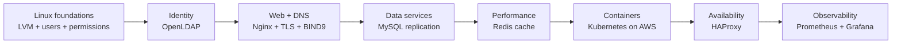
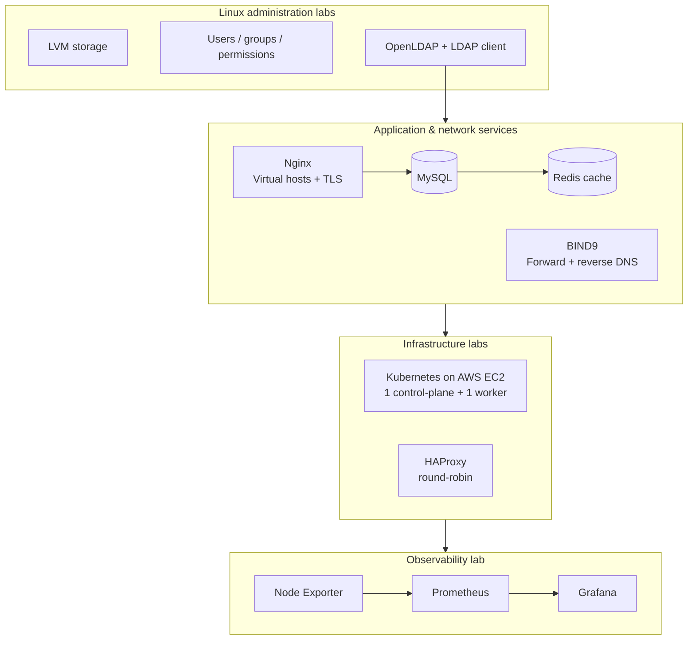

# Server Administration & Infrastructure Lab

> Evidence-based portfolio case study covering Linux systems administration, network services, data services, container orchestration, high availability, and observability.

**Course:** Administrasi Sistem Server — Teknik Informatika, Universitas Brawijaya  
**Project type:** Collaborative semester-long laboratory portfolio  
**Role:** **Group Lead / Ketua Kelompok & Systems Administration Contributor — Syifani Adillah Salsabila**  
**Team:** Syifani Adillah Salsabila, Mochammad Attila Eka Raharjo, Ananda Fifadlika  
**Period:** 2025/2026 academic year

## Overview

This repository reconstructs a 181-page final server-administration module into a recruiter-friendly engineering portfolio. The coursework progressed from Linux storage and identity fundamentals into centralized directory services, web/DNS/database administration, caching, Kubernetes on AWS, load balancing, and production-style monitoring.

The public repository intentionally **does not publish the raw report** because it contains student identifiers, historical lab addresses, screenshots, and environment-specific credentials. Instead, this repository keeps sanitized examples and maps every portfolio claim back to retained report evidence.

> **Important scope note:** the modules were separate hands-on labs. The diagram and documentation below show the progression of skills; they do **not** claim that every component ran as one single production platform.

## Skill progression

## What was actually validated

| Area | Retained result | Evidence level |
|---|---|---|
| LVM | Added a virtual disk, created a PV, extended the VG/LV, resized `/home`, and verified capacity growth | **Verified** |
| Linux IAM | Created users/groups, sudo access, file ownership, and permission boundaries | **Verified** |
| OpenLDAP | Centralized OU/group/user management and LDAP client login after NSS/PAM troubleshooting | **Verified** |
| Nginx | Two virtual hosts, HTTPS with self-signed TLS, HTTP→HTTPS redirect, gzip/static-cache tuning | **Verified** |
| BIND9 DNS | Forward zones, reverse zone/PTR, client DNS configuration, successful `nslookup` | **Verified** |
| MySQL | Nginx/PHP-FPM/phpMyAdmin plus asynchronous primary-replica lab; IO/SQL replication threads reported running | **Verified** |
| Redis | Database access measured at ~70 ms without cache vs ~3.7 ms with Redis in the lab (~19× faster) | **Verified experiment** |
| Kubernetes | Two-node AWS EC2 cluster, containerd, kubeadm, Calico; both nodes reached `Ready` | **Verified** |
| HAProxy | Repeated `curl` responses alternated between two Nginx backends using round-robin | **Verified** |
| Monitoring | Node Exporter target `UP`, Prometheus scraping, Grafana dashboard, Prometheus API queried via cURL/Python | **Verified** |

## Representative architecture map

## Highlights a senior reviewer can discuss

### 1. Storage expansion with LVM
The lab added a new virtual disk, converted it into a Physical Volume, extended the existing Volume Group, grew the Logical Volume backing `/home`, resized the filesystem, and verified the new capacity with `df -h`.

### 2. Centralized identity with LDAP
OpenLDAP and LDAP Account Manager were configured with organizational units and Unix accounts. A client machine was then connected through NSS/PAM. A failed LDAP-login path was debugged by correcting the client integration and restarting the relevant name-service layer.

### 3. Web and DNS administration
Nginx hosted multiple virtual hosts on one server, added a self-signed TLS certificate, redirected HTTP to HTTPS, and applied basic static-cache/gzip/worker tuning. BIND9 was configured with two forward zones and a reverse zone, and clients successfully resolved the lab domains.

### 4. Database replication
The database module covered MySQL administration via phpMyAdmin and an asynchronous replication exercise. The retained evidence records `Slave_IO_Running = Yes` and `Slave_SQL_Running = Yes`, followed by changes on the primary appearing on the replica.

### 5. Measured Redis caching effect
The report records approximately **0.07 s** for a direct database read and **0.0037 s** for the Redis-backed path in that experiment—roughly **19× faster**. This is a lab measurement, not a universal Redis benchmark.

### 6. Kubernetes on AWS EC2
A two-node Kubernetes cluster was built using EC2, containerd, kubeadm/kubelet/kubectl, and Calico. Troubleshooting included EC2 IP detection, containerd installation, repository/GPG changes, security-group rules for the API server, and swap configuration. Both nodes eventually reached `Ready`.

### 7. Load balancing and observability
HAProxy was configured in front of two Nginx servers and validated by alternating backend responses under repeated `curl`. The monitoring lab then used Node Exporter → Prometheus → Grafana, with Node Exporter shown `UP` in Prometheus and metrics also accessed programmatically.

## Team

| Member | Portfolio attribution |
|---|---|
| **Syifani Adillah Salsabila** | **Group Lead / Ketua Kelompok & Systems Administration Contributor** |
| Mochammad Attila Eka Raharjo | Team Member |
| Ananda Fifadlika | Team Member |

This was collaborative coursework. The repository does **not** claim that Syifani authored every screenshot, command, or section of the original 181-page report individually.

## Documentation

- [Lab overview](LAB_OVERVIEW.md)
- [Architecture and scope](ARCHITECTURE.md)
- [Verified results](RESULTS.md)
- [Team attribution](TEAM_ATTRIBUTION.md)
- [Source evidence map](SOURCE_EVIDENCE.md)
- [Security and redaction](SECURITY.md)
- [Limitations](LIMITATIONS.md)
- [Portfolio / CV copy](PORTFOLIO.md)
- [Detailed evidence matrix](docs/EVIDENCE_MAP.md)

### Module notes

1. [Storage with LVM](docs/01-storage-lvm.md)
2. [Linux users & permissions](docs/02-user-permissions.md)
3. [OpenLDAP centralized identity](docs/03-openldap.md)
4. [Nginx virtual hosts & TLS](docs/04-nginx-tls.md)
5. [BIND9 DNS](docs/05-bind9-dns.md)
6. [MySQL administration & replication](docs/06-mysql-replication.md)
7. [Redis caching](docs/07-redis-caching.md)
8. [Kubernetes on AWS](docs/08-kubernetes-aws.md)
9. [HAProxy load balancing](docs/09-haproxy-load-balancing.md)
10. [Prometheus & Grafana](docs/10-prometheus-grafana.md)

## Public-repository policy

No raw passwords, private keys, cloud credentials, student IDs, or historical deployment secrets are intentionally stored here. All example configuration values are placeholders.