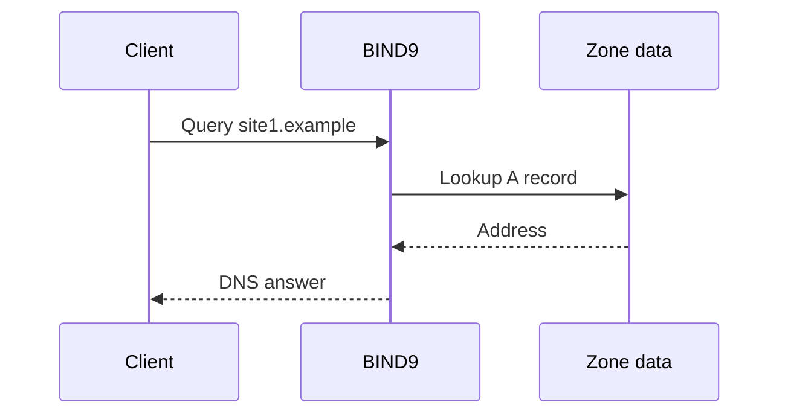

# BIND9 DNS

## Verified lab outcomes
- Installed BIND9 on Ubuntu.
- Defined separate forward zones for two lab domains.
- Added a reverse zone with PTR mapping.
- Allowed DNS traffic through UFW.
- Pointed a client to the DNS server.
- Verified forward resolution using `nslookup`.

## Request path

See [`examples/bind9/named.conf.local.example`](../examples/bind9/named.conf.local.example) for a sanitized example.