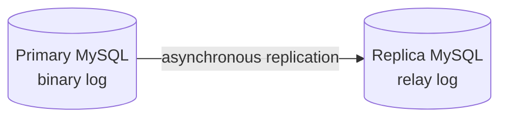

# MySQL Administration & Replication

## Web administration path
The module installed MySQL, Nginx, PHP-FPM and phpMyAdmin, then exposed phpMyAdmin through a manually configured Nginx virtual host.

## Replication lab
The retained report uses the older term “Master–Slave.” This portfolio uses **primary/replica** where possible.

### Verified indicators
- primary binary logging enabled;
- dedicated replication user and privileges configured;
- replica connection initialized with primary host/user/log position;
- `Slave_IO_Running = Yes`;
- `Slave_SQL_Running = Yes`;
- a data change on the primary appeared on the replica.

## Limitations
Asynchronous replication can lag. The exercise does not prove automatic failover, split-brain protection, backup correctness, or production RPO/RTO.