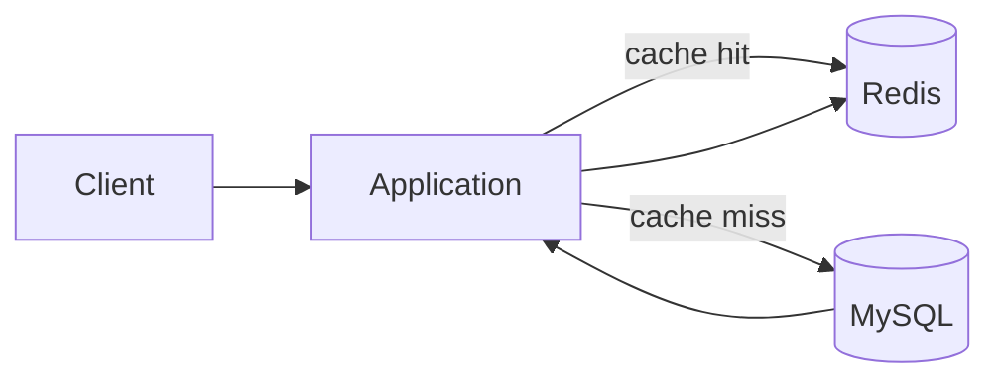

# Redis Caching Experiment

## Pattern

## Retained measurement

| Path | Time recorded in report |
|---|---:|
| Direct MySQL access | ~0.07 s |
| Redis-backed access | ~0.0037 s |

That is roughly **19× faster in the recorded run**.

## Interpretation
Redis avoids repeated database query/network/storage work on cache hits by serving data from memory. The result is useful evidence of caching mechanics, but not a general benchmark.

## Production concerns
- cache invalidation and TTL policy;
- stale data;
- cache stampede;
- memory sizing/eviction policy;
- Redis authentication/TLS/network exposure;
- failure behavior when cache is unavailable.