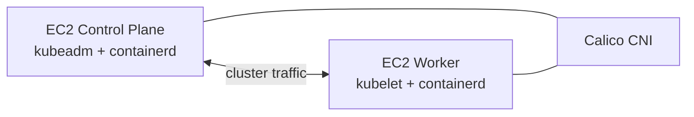

# Kubernetes on AWS EC2

## Lab topology

## Verified outcome
A Kubernetes cluster with one control-plane node and one worker node was formed successfully, and both nodes reached `Ready`.

## Components exercised
- AWS EC2
- Ubuntu
- containerd
- kubeadm / kubelet / kubectl
- Calico CNI
- Deployment/Pod/Service concepts

## Troubleshooting retained in the report

1. **EC2 IP detection** — installation script assumptions were incompatible with the cloud environment; detection was adjusted to a more robust route/metadata approach.
2. **containerd installation** — archive extraction/path handling initially prevented the runtime binary from being installed correctly.
3. **Kubernetes repository/GPG** — scripts needed updating for current repository/keyring handling.
4. **Security groups** — worker join timed out until the control-plane API port was reachable from the worker.
5. **Swap** — swap had to remain disabled for kubelet behavior.

## Scope limitation
A two-node learning cluster does not provide a highly available Kubernetes control plane. See `LIMITATIONS.md`.