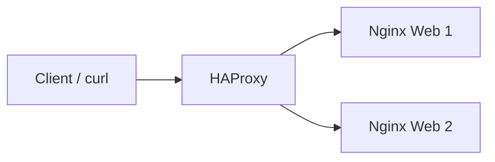

# HAProxy Load Balancing

## Topology

## Configuration behavior
The backend used round-robin scheduling across two Nginx servers.

## Verified result
Repeated `curl` calls to the HAProxy endpoint returned the server-1 and server-2 response bodies alternately. This verifies request distribution under the configured round-robin policy.

A sanitized example is available in [`examples/haproxy/haproxy.cfg.example`](../examples/haproxy/haproxy.cfg.example).

## What was not proven
- automated backend failure/recovery timing;
- health-check thresholds under fault injection;
- high-load throughput/latency;
- session persistence;
- multi-load-balancer HA.