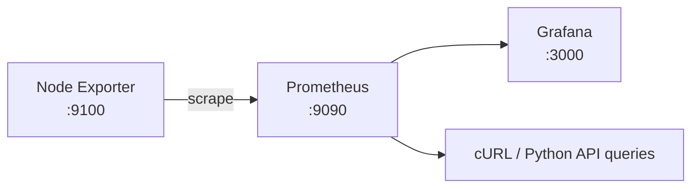

# Prometheus, Node Exporter & Grafana

## Monitoring pipeline

## Verified results
- Node Exporter exposed CPU, memory, disk and network metrics.
- Prometheus scraped Node Exporter successfully.
- Prometheus Targets UI showed Node Exporter as **UP**.
- Grafana connected to Prometheus and rendered the Node Exporter Full dashboard.
- Prometheus API queries were tested with cURL and Python and returned JSON metric data.

## Production extensions
This lab proves telemetry collection/visualization. A production observability platform should add alert rules, Alertmanager/on-call routing, SLOs, retention planning, authentication/TLS, backup, and access control.